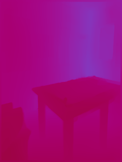

# DenseDepth-Pytorch

A simple PyTorch Implementation of  the "High Quality Monocular Depth Estimation via Transfer Learning" paper.

The paper can be read [here](https://arxiv.org/abs/1812.11941).

Official Implementation can be found [here](https://github.com/ialhashim/DenseDepth).

## Training

* The model was trained on the [NYU Depth V2](https://cs.nyu.edu/~silberman/datasets/nyu_depth_v2.html) dataset.

* There is no need to manually download the dataset. The file [download_data.py](https://github.com/pranjaldatta/DenseDepth-Pytorch/blob/master/densedepth/download_data.py) handles this. To use this, simply run the following command from the project root,

```shell
$ python densedepth/download_data.py
```

* The model was trained for 7 epochs (~ 7/8 hours). In contrast, the authors train for 1 M epochs for 20 Hours.

* Since the model was trained on Google Colab, it was trained periodically when Nvidia T4 or P100s were available. Training on a single 12 GB Tesla K80 takes too long. In contrast, the authors use a cluster of 4 Tesla K80s.

* Train Loss at the end of the 7th epoch was  ~0.17.

## Quick Start  

To immediately start training without any set-up, go to the notebook [DenseDepth_training.ipynb](https://github.com/pranjaldatta/DenseDepth-Pytorch/blob/master/DenseDepth_training.ipynb) (use [this](https://nbviewer.jupyter.org/github/pranjaldatta/DenseDepth-Pytorch/blob/master/DenseDepth_training.ipynb) link if it doesn't work) and open it in Google's Colaboratory, and simply run all the cells!

The notebook by default, asks you to link your Google Drive so as to save the checkpoints, but you can skip this step and instead save it in runtime memory.

## Usage

All the required files are in the *[densedepth](https://github.com/pranjaldatta/DenseDepth-Pytorch/tree/master/densedepth)* directory.

* *Step 1:* Clone the repository

```python
git clone https://github.com/pranjaldatta/DenseDepth-Pytorch.git
```

* *Step 4:* Go into Project root by,

```shell
$ cd DenseDepth-Pytorch
```

* *Step 3:*  To train,

```python
python desedepth/train.py --epochs 10 \
                          --batch 4 \
                          --save "directory where checkpoints are to saved" \
                          --device "cuda" \
                          --checkpoint "path to checkpoint from which to resume training"
```

* *Step 4:* To test,

```python
python densedepth/test.py --checkpoint "<path to checkpoint>" \
                          --device "cuda" \
                          --data "examples/"
```

For help,

```python
python densedepth/train.py --help
```

## Results

| Image | Prediction |
------|-----------|
| </img>||
| </img>||
| </img>||
| </img>||
| </img>||

For more examples, check [here.](https://github.com/pranjaldatta/DenseDepth-Pytorch/tree/master/examples)
